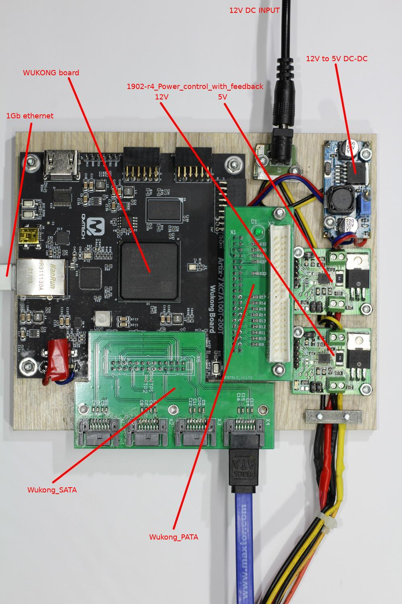
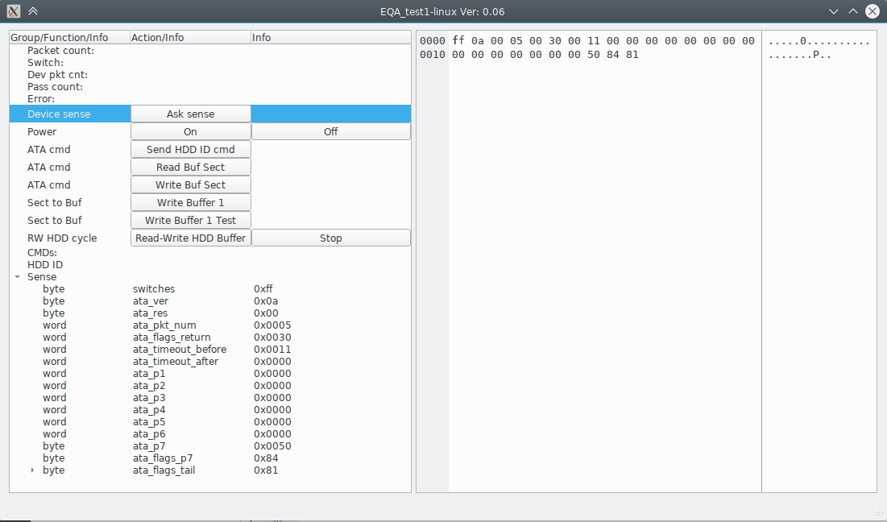
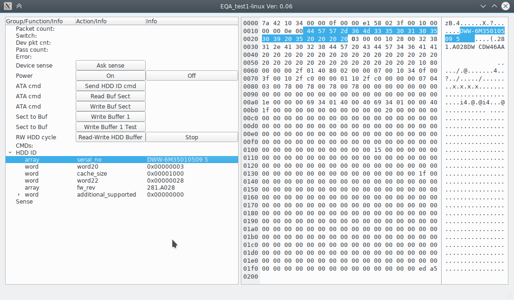

# EQA
1Gb Ethernet, Qt, ATA

EQA boards assembly:

Using this FPGA board:

https://github.com/ChinaQMTECH/QM_XC7A100T_WUKONG_BOARD/

PC software screens:

Get device sense packet for know current state:

Read HDD ID sector result:

Author: Sergei Yatsenko <s@rlab.ru>
